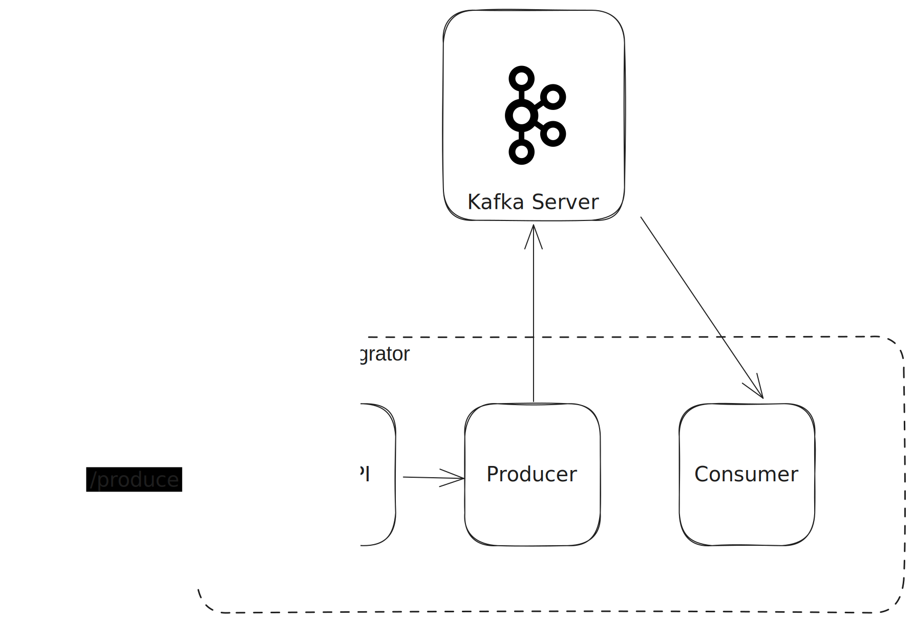

# KafkaIntegrationProject

## Description
This project is a simple example of how to integrate Kafka with WSO2 Micro Integrator.




## How to build
Use the below command to build the project
```bash
mvn clean install -Dmaven.test.skip=true
```

## Deploying the artifacts
1. Copy the `KafkaIntegrationProjectCompositeExporter/target/KafkaIntegrationProjectCompositeExporter.car` file into the `<MI_HOME>/dropins` directory.
2. Copy the required JAR files from `/libs` directory into the `<MI_HOME>/lib` directory.
3. Set the enviorment variable `KAFKA_URL` to the Kafka server URL and `KAFKA_JAAS_CONFIG` to the JAAS config formatted as,
    ```
    org.apache.kafka.common.security.plain.PlainLoginModule required username="<USER_NAME>" password="<PASSWORD>";
    ```
4. Start the MI server.

## How to test

Use Postman or curl to send a POST request to the MI server `localhost:8290/produce` with the following payload.
```json
{
   "id": 1,
    "desc": "Order Description",
    "paymentStatus": "SUCCESS"
}
```
You will see this message logged in the terminal.
